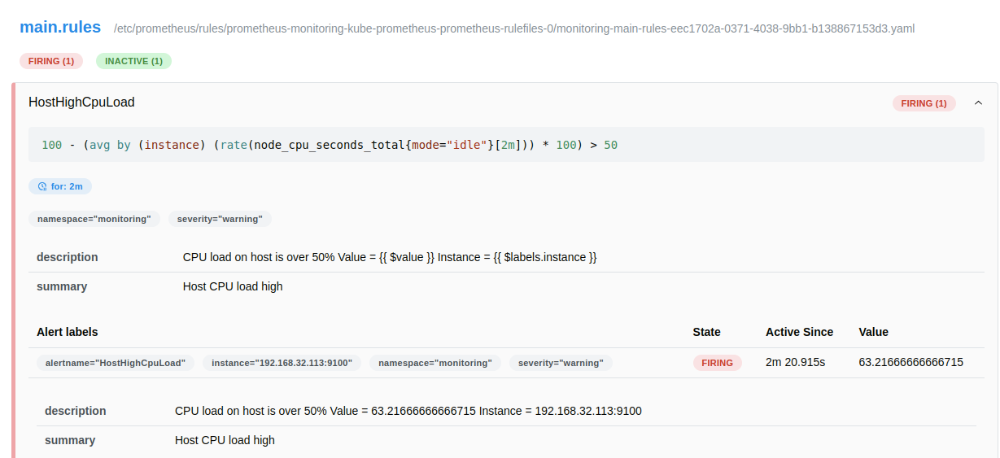
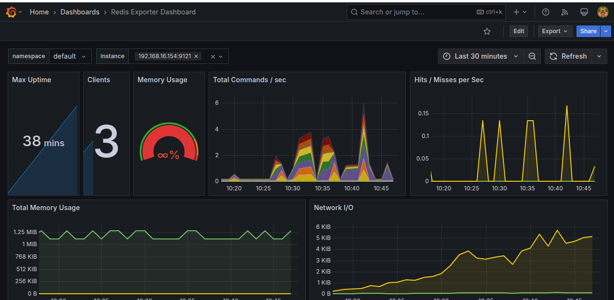

# Demo Project 1

Install Prometheus Stack in Kubernetes

## Technologies Used

Prometheus, Kubernetes, Helm, AWS EKS, eksctl, Grafana, Linux

## Project Description

- Setup EKS cluster using eksctl
- Deploy Prometheus, Alert Manager and Grafana in cluster as part of the Prometheus Operator using Helm chart

### Details of project

- Create a Cluster in EKS

  To complete this project, a Kubernetes cluster was created using eksctl. This command initializes a cluster in the default region, with default credentials, and provisions two worker nodes:

  ```
    eksctl create cluster
  ```

  After setting up the cluster, the deployment of the microservices-based online shop application was carried out. The application is hosted in the following repository:

  Repository link: https://github.com/Mauricio-Camilo/devops-bootcamp-m10-kubernetes/tree/main/helm-chart-microservices

  ```
    kubectl apply -f config.yaml
  ```

- Deploy Prometheus Stack Using Helm

  The following two commands were executed:

  ```
    helm repo add prometheus-community https://prometheus-community.github.io/helm-charts
    helm repo update
  ```

  The first command adds the Helm chart repository named prometheus-community to the local list of known Helm repositories. The second command updates the local list of available charts from all added repositories.

  Next, a new namespace was created, and Helm was used to install the monitoring stack within that namespace:

  ```
    helm install monitoring prometheus-community/kube-prometheus-stack -n monitoring
  ```

  

  With this command, several Prometheus components were installed and are now running in the cluster.

- Understanding Prometheus Stack Components

  After the deployment, the following components were created and running inside the cluster:

    2 StatefulSets:

    Core Prometheus Server

    Alert Manager

    3 Deployments with ReplicaSets:

    Prometheus Operator

    Grafana

    Kube State Metrics

    1 DaemonSet:

    Node Exporter: Runs on every worker node in the Kubernetes cluster. It translates worker node metrics into Prometheus metrics.

  Additionally, there are various Pods and Services, including those for Grafana, Node Exporter, and the Prometheus Operator, among others.

  In summary, with this deployment, the cluster is now capable of monitoring both worker nodes and Kubernetes components.

- Prometheus UI

  Some application metrics can be accessed through the graphical interface provided by the monitoring-kube-prometheus-prometheus service. To forward the Prometheus service port to localhost, execute the following command:

  ```
    kubectl port-forward service/monitoring-kube-prometheus-prometheus -n monitoring 9090:9090
  ```

  

  Once the port-forwarding is established, the Prometheus UI can be accessed via a web browser at http://localhost:9090. The interface allows viewing application and cluster metrics. However, while Prometheus UI is useful for querying raw data, it is not the most effective tool for graphical visualization.

  For better visualization, Grafana is recommended, as it provides more advanced dashboarding and visualization capabilities.

# Demo Project 2

Configure Alerting for our Application

## Technologies Used

Prometheus, Kubernetes, Linux

## Project Description

Configure our Monitoring Stack to notify us whenever CPU usage > 50% or Pod cannot start
- Configure Alert Rules in Prometheus Server
- Configure Alertmanager with Email Receiver

### Details of project

- Create 1st Rule (CPU Usage > 50%)

  To define an alert rule, a YAML file named alert-rules.yaml was created. The rule was based on an alert configuration from the Prometheus UI.

  ```
    - alert: HostHighCpuLoad
    expr: 100 - (avg by(instance) (rate(node_cpu_seconds_total{mode="idle"}[2m])) * 100) > 50
    for: 2m
    labels:
        severity: warning
        namespace: monitoring
    annotations:
        description: "CPU load on host is over 50%\n Value = {{ $value }}\n Instance = {{ $labels.instance }}"
        summary: "Host CPU load high"
  ```

- Alert Rule in Kubernetes

  To enable Kubernetes to use the alert rule, given that the Prometheus Operator is running in the cluster, the following process occurs:

    - Prometheus Operator extends the Kubernetes API.

    - We create custom Kubernetes resources.

    - The operator detects the new custom resource and instructs Prometheus to reload the alert rule.

  To define the alert rule, a Kubernetes custom resource of type PrometheusRule is created. Within its specifications, a rule parameter contains the YAML definition of the alert rule.

- Create 2nd Rule (Pod Cannot Start)

  Multiple alert rules can be defined within the same alert-rules.yaml object. Another alert was added to detect when a pod repeatedly fails to start.

  ```
    - alert: KubernetesPodCrashLooping
    expr: kube_pod_container_status_restarts_total > 5
    for: 0m
    labels:
        severity: critical
        namespace: monitoring
    annotations:
        description: "Pod {{ $labels.pod }} is crash looping\n Value = {{ $value }}"
        summary: "Kubernetes pod crash looping"
  ```

  Additionally, labels were added to the object so other cluster components can identify it:

  ```
    labels:
    app: kube-prometheus-stack
    release: monitoring
  ```

- Apply Alert Rules

  To apply the alert rules, execute the following command:

  ```
    kubectl apply -f alert-rules.yaml
  ```

  Once applied, the newly created alert appears in the Prometheus UI.

  

- Test Alert Rule

  To test the CPU usage alert, a high CPU load was simulated in the cluster.

  Steps:

    - Search for the cpustress image in Docker Hub.

    - Run the following command to stress the CPU:

    ```
        docker run -it --name cpustress --rm containerstack/cpustress --cpu 4 --timeout 30s --metrics-brief
    ```
    - Convert this command into a Kubernetes command:

    ```
        kubectl run cpu-test --image=containerstack/cpustress -- --cpu 4 --timeout 60s --metrics-brief
    ```
 
  By running this image, CPU usage in the cluster exceeds 50%, triggering the alert. Initially, the alert status appears as Pending, but after the configured two minutes, it transitions to Firing.

  

- Configure Email Notification

  A new YAML file named alert-manager-config.yaml was created to configure Alertmanager. The configuration includes two sections: receivers and route.

  Receiver Configuration:

  ```
    receivers:
    - name: 'email'
        emailConfigs:
        - to: 'mauricio.ecamilo@gmail.com'
            from: 'mauricio.ecamilo@gmail.com'
            smarthost: 'smtp.gmail.com:587'
            authUsername: 'mauricio.ecamilo@gmail.com'
            authIdentity: 'mauricio.ecamilo@gmail.com'
            authPassword:
            name: gmail-auth
            key: password
  ```

  To enable email notifications, an App Password was configured for Gmail’s two-step authentication.

  Routing Configuration:

  ```
    route:
    receiver: 'email'
    repeatInterval: 30m
    routes:
        - matchers:
            - name: alertname
            value: HostHighCpuLoad
        - matchers:
            - name: alertname
            value: KubernetesPodCrashLooping
        repeatInterval: 30m
  ```      
  To apply the email alert configurations, execute the following commands:

  ```
    kubectl apply -f email-secret.yaml
    kubectl apply -f alert-manager-config.yaml
  ```
  Now, the Prometheus UI reflects the Alertmanager setup, including the configured receivers.

  

- Test Email Notification

  To test the email notification, the CPU load pod was deleted and recreated with a 60-second timeout:

  ```
    kubectl run cpu-test --image=containerstack/cpustress -- --cpu 4 --timeout 30s --metrics-brief
  ```

  This triggered the alert again, and an email notification was successfully received.

  

# Demo Project 3

Configure Monitoring for a Third-Party Application

## Technologies Used

Prometheus, Kubernetes, Redis, Helm, Grafana

## Project Description

Monitor Redis by using Prometheus Exporter
- Deploy Redis service in our cluster
- Deploy Redis exporter using Helm Chart
- Configure Alert Rules (when Redis is down or has too many connections)
- Import Grafana Dashboard for Redis to visualize monitoring data in Grafana

### Details of project

- Install Redis Exporter using Helm

  In this project, configurations were made to collect Redis application metrics running inside a Kubernetes cluster using an exporter. To simplify the process, an existing Helm chart for the Redis exporter was used, containing all necessary configurations with only minor variable customizations required.

  Helm Chart Used: Prometheus Redis Exporter

  A new YAML file, redis-values.yaml, was created to specify only the required values for the Redis exporter when installing the Helm chart.

  Helm Installation Commands:

  ```
    helm repo add prometheus-community https://prometheus-community.github.io/helm-charts
    helm repo update
    helm install redis-exporter prometheus-community/prometheus-redis-exporter -f redis-values.yaml
  ```

  

  It is possible to verify the creation of the exporter through Helm, Pods, or ServiceMonitor, and also in the Prometheus UI, where it appears as a new target.

  

- Create Alert Rules

  Two alert rules were created to notify when Redis is down and when there are too many connections. These rules were added in the redis-rules.yaml file.

  The alert rules were based on examples from Awesome Prometheus Alerts.

  ```
    - alert: RedisDown
    expr: redis_up == 0
    for: 0m
    labels:
        severity: critical
    annotations:
        summary: Redis down (instance {{ $labels.instance }})
        description: "Redis instance is down\n  VALUE = {{ $value }}\n  LABELS = {{ $labels }}"
  ```
  ```
    - alert: RedisTooManyConnections
    expr: redis_connected_clients / redis_config_maxclients * 100 > 90
    for: 2m
    labels:
        severity: warning
    annotations:
        summary: Redis too many connections (instance {{ $labels.instance }})
        description: "Redis has {{ $value }} connections\n LABELS = {{ $labels }}"
  ```

  Apply Alert Rules:

  ```
    kubectl apply -f redis-rules.yaml
  ```

  The new alerts can now be seen in the Prometheus UI.

  

- Trigger Alert Rules

  To test the RedisDown alert, the number of replicas for the Redis deployment was set to 0, triggering the alert in Prometheus.

- Create Redis Dashboard in Grafana

  To improve metric visualization, a pre-configured Grafana dashboard was used to display Redis metrics.

  The template for this dashboard was found online and imported into Grafana using its Dashboard ID:

  Grafana Dashboard: https://grafana.com/grafana/dashboards/763-redis-dashboard-for-prometheus-redis-exporter-1-x/

  

  With this approach, dashboards can be easily created for widely used applications, ensuring better observability of Redis performance and health.

# Demo Project 4

Configure Monitoring for Own Application

## Technologies Used

Prometheus, Kubernetes, Node.js, Grafana, Docker, Docker Hub

## Project Description

- Configure our NodeJS application to collect & expose Metrics with Prometheus Client Library
- Deploy the NodeJS application, which has a metrics endpoint configured, into Kubernetes cluster
- Configure Prometheus to scrape this exposed metrics and visualize it in Grafana Dashboard

### Details of project

- Expose Metrics - Node.js Client Library

  In this project, Prometheus client libraries were used to monitor a Node.js application, as no specific exporter exists for it.

- Metrics Monitored

  The following application metrics were analyzed:

    - Number of HTTP requests

    - Duration of HTTP requests

  The development team is responsible for installing the Prometheus client and exposing the application metrics. A base code was used where the Prometheus client is already integrated into the Node.js application.

- Prometheus Client Installation

  The client used is prom-client, which is listed in the package.json file.

  In server.js, the client is imported and initialized:

  ```
    const client = require('prom-client');
    const collectDefaultMetrics = client.collectDefaultMetrics;

    // Probe every 5 seconds.
    collectDefaultMetrics({ timeout: 5000 });
  ```

- Defining and Exposing Metrics

  Two variables were created to expose the required metrics:

  ```
    const httpRequestsTotal = new client.Counter({
    name: 'http_request_operations_total',
    help: 'Total number of HTTP requests'
    });

    const httpRequestDurationSeconds = new client.Histogram({
    name: 'http_request_duration_seconds',
    help: 'Duration of HTTP requests in seconds',
    buckets: [0.1, 0.5, 2, 5, 10]
    });
  ```

  The Counter type is used to track the number of HTTP requests.

  The Histogram type tracks the sizes and frequencies of events (request durations).

  These variables were implemented in the application’s endpoints.

  To expose these metrics, a /metrics route was created:

  ```
    app.get('/metrics', async (req, res) => {
    res.set('Content-Type', client.register.contentType);
    res.end(await client.register.metrics());
    });
  ```

  When accessing this endpoint in a browser, it is possible to view the monitored metrics.

- Deploy Application to Kubernetes

  A Dockerfile was created to build an image of the application and push it to Docker Hub.

  ```
    docker build -t <DOCKER REPO NAME>/demo-app:nodeapp .
    docker login
    docker push <DOCKER REPO NAME>/demo-app:nodeapp
  ```

- Kubernetes Deployment

  A deployment was defined in k8s-config.yaml to deploy the application from Docker Hub to the Kubernetes cluster.

  To securely store authentication details, a secret was manually created for Docker Hub authentication:

  ```
    kubectl create secret docker-registry my-registry-key \
    --docker-server=https://index.docker.io/v1/ \
    --docker-username=<username> \
    --docker-password=<password>
  ```

  To apply the deployment:

  ```
    kubectl apply -f k8s-config.yaml
  ```

  To access the application locally, port forwarding was set up:

  ```
    kubectl port-forward svc/nodeapp 3000:3000
  ```

- ServiceMonitor for Prometheus

  A ServiceMonitor was created in the same YAML file as the application to link Prometheus with the application's /metrics endpoint.

  ```
    apiVersion: monitoring.coreos.com/v1
    kind: ServiceMonitor
    metadata:
    name: monitoring-node-app
    labels:
        release: monitoring
        app: nodeapp
    spec:
    endpoints:
    - path: /metrics
        port: service
        targetPort: 3000
    namespaceSelector:
        matchNames:
        - default
    selector:
        matchLabels:
        app: nodeapp
  ```
  After applying the changes, the Prometheus UI confirms that the metrics were successfully imported.

    

- Grafana Dashboard

  Two simple panels were created in Grafana to visualize the application metrics:

    - Requests per Second using the query: rate(http_request_operations_total[2m])

    - Request Duration using the query: rate(http_request_duration_seconds_sum[2m])

  Once set up, the dashboard provides a clear visualization of request counts and durations. By accessing the application in a browser and refreshing the page multiple times, the dashboard updates dynamically.

    

  This setup enables efficient monitoring of Node.js applications, ensuring visibility into request handling and performance trends.


